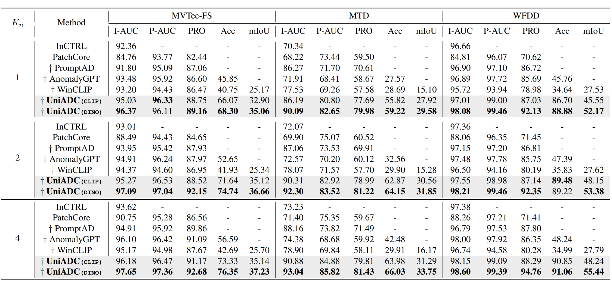
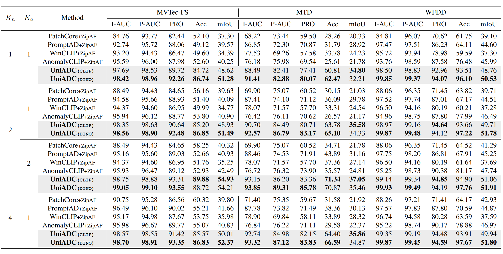
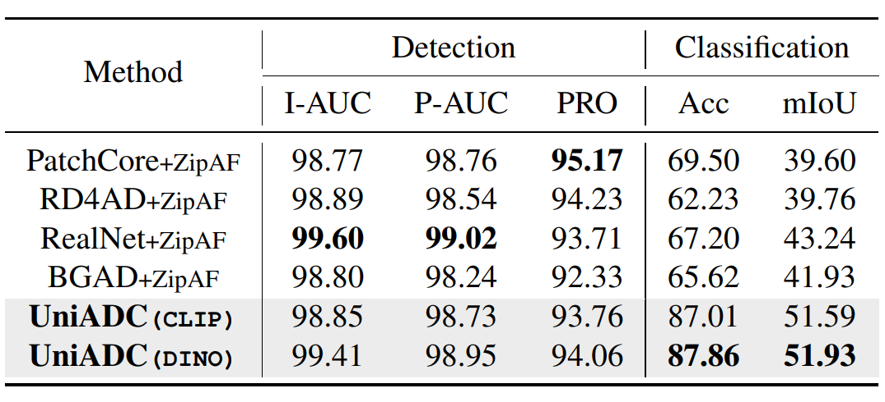
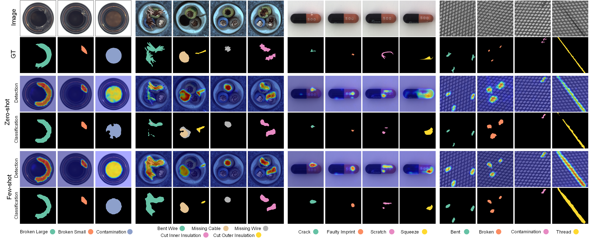
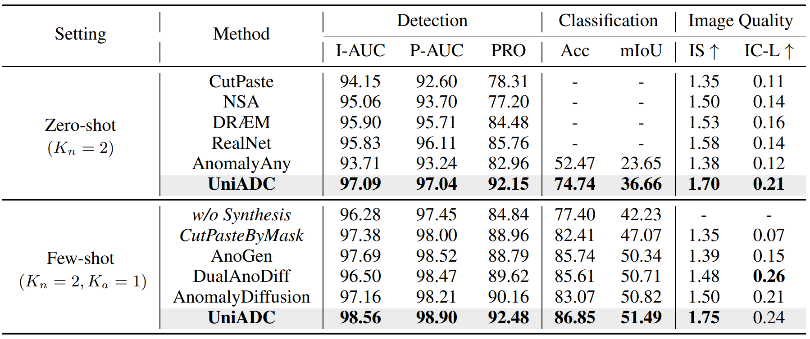

# UniADC  
<a href=''></a>
> Official Implementation of the paper [UniADC: A Unified Framework for Anomaly Detection and Classification]().  
> **The code will be released upon acceptance.**
 
## Introduction
We propose a novel unified framework for anomaly detection and classification, called UniADC, which can accurately detect and classify anomalous regions in images using only a few or even no anomalous images. Moreover, UniADC exhibits powerful anomaly synthesis capabilities, enabling the generation of class-specific anomalous samples guided by anomaly priors or few-shot anomaly examples.  
  
### What can UniADC do?
- **Anomaly Detection**
- **Anomaly Localization**
- **Anomaly Classification (Image-level and Pixel-level)**
- **Zero-shot Anomaly Synthesis (Training-free, Text-to-image generation)**
- **Few-shot Anomaly Synthesis (Training-free, Image-to-image generation)**
  
<div align=center></div>  
  
## Experiments  
### Anomaly Detection and Classification  
<div align="center"><b>Few-shot Normal Samples Only</b></div>
<div align=center></div>   

<div align="center"><b>Few-shot Normal and Anomaly Samples</b></div>
<div align=center></div>   
  
<div align="center"><b>Full-shot Normal Samples with a few Anomaly Samples</b></div>
<div align=center></div>   
  
<div align="center"><b>Qualitative Results</b></div>  
<div align=center></div>  


### Anomaly Synthesis  
<div align="center"><b>Comparison with Other Methods</b></div>  
<div align=center></div>

<div align="center"><b>Qualitative Results</b></div>  
<div align=center></div> 


## Citation  
```
Coming soon.
```

