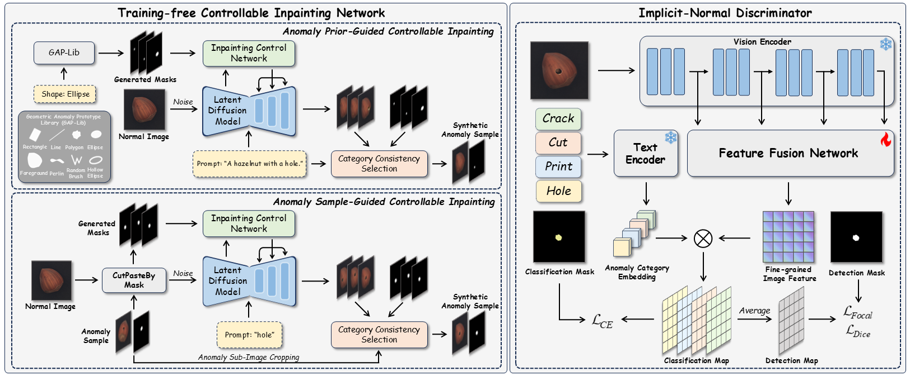
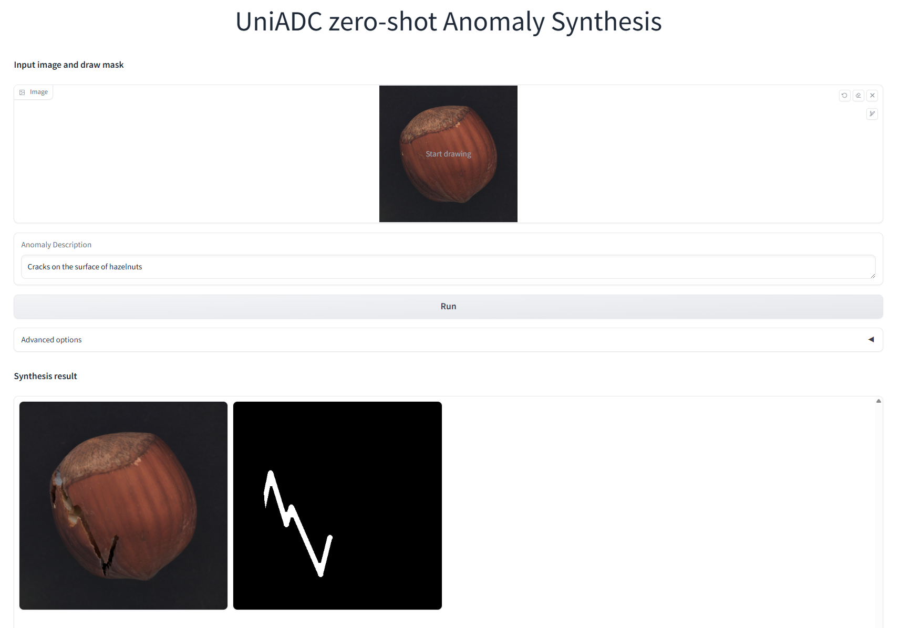
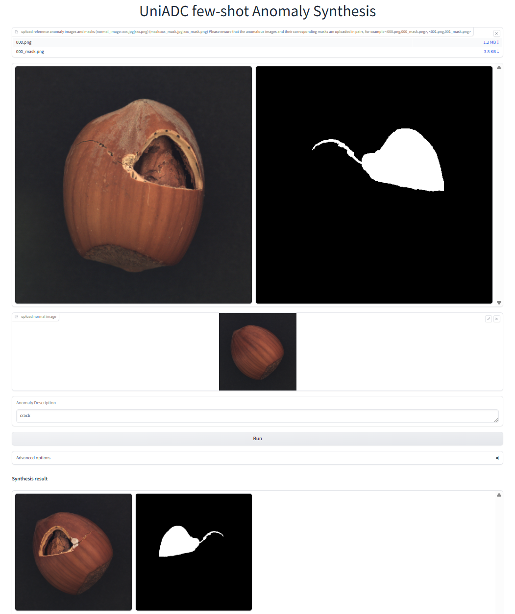

# UniADC  
<a href='https://arxiv.org/abs/2511.06644'></a>
> Official Implementation of the paper [UniADC: A Unified Framework for Anomaly Detection and Classification](https://arxiv.org/abs/2511.06644).  

## Introduction
We propose a novel unified framework for anomaly detection and classification, called UniADC, which can accurately detect and classify anomalous regions in images using only a few or even no anomalous images. Moreover, UniADC exhibits powerful anomaly synthesis capabilities, enabling the generation of class-specific anomalous samples guided by anomaly priors or few-shot anomaly examples.  
  
### What can UniADC do?
- **Anomaly Detection**
- **Anomaly Localization**
- **Anomaly Classification (Image-level and Pixel-level)**
- **Zero-shot Anomaly Synthesis (Training-free, Text-to-image generation)**
- **Few-shot Anomaly Synthesis (Training-free, Image-to-image generation)**
  
<div align=center></div>  
  
## Experiments  
### Installation

To run experiments, first clone the repository and install `requirements.txt`.

```
$ git clone https://github.com/cnulab/UniADC.git
$ cd UniADC
$ pip install -r requirements.txt
```  
### Download Pre-trained Models
1. Request [DINOv3](https://ai.meta.com/resources/models-and-libraries/dinov3-downloads/) weights, and download DINOv3-B/16 (dinov3_vitb16_pretrain_lvd1689m-73cec8be.pth) and DINOv3-based dino.txt (dinov3_vitl16_dinotxt_vision_head_and_text_encoder-a442d8f5.pth).  
2. Run `sh download.sh` to download other dependency weights.

All weight files are placed in the `ckpt` directory. The complete directory structure is as follows:
  ```
    |--ckpt                         
        |--birefnet  #BiRefNet
            |--BiRefNet_config.py
            |--birefnet.py
            |--model.safetensors
            |--...
        |--realisticVisionV60B1_v51VAE      #Stable Diffusion v1.5
            |--feature_extractor
            |--...
        |--random_mask_brushnet_ckpt        #BrushNet
            |--config.json
            |--diffusion_pytorch_model.safetensors
        |--segmentation_mask_brushnet_ckpt  #BrushNet
            |--config.json
            |--diffusion_pytorch_model.safetensors
        |--clip_l14_336_grit_20m_4xe.pth    #AlphaCLIP
        |--dinov3_vitb16_pretrain_lvd1689m-73cec8be.pth  #DINOv3
        |--dinov3_vitl16_dinotxt_vision_head_and_text_encoder-a442d8f5.pth #dino.txt
  
```
  
If you cannot use `download.sh` for automatic downloading, you can download manually via the following links:  
  
- [BiRefNet](https://huggingface.co/ZhengPeng7/BiRefNet)
- [BrushNet and Stable Diffusion](https://drive.google.com/drive/folders/1fqmS1CEOvXCxNWFrsSYd_jHYXxrydh1n)
- [AlphaCLIP](https://drive.google.com/file/d/1PvMJfg7nSVr98FfeBYSDAnbntGPWeDY6/view?usp=sharing)
- [DINO](https://ai.meta.com/resources/models-and-libraries/dinov3-downloads/)

### Download Datasets  
*Note: Please ensure you download the dataset via our provided links. The original MVTec dataset is not supported as it lacks fine-grained anomaly class labels.*

| Datasets |  Hugging Face | ☁️Google Drive |
|:------:|:--------:|:-------:|
| MVTec-FS | [XimiaoZhang/MVTec-FS](https://huggingface.co/datasets/XimiaoZhang/MVTec-FS)  | [MVTec-FS.zip](https://drive.google.com/file/d/1Q-q21nVAcsSVyDD64AjAUoOfp5Flh__A/view?usp=sharing)  |
| WFDD  | [XimiaoZhang/WFDD](https://huggingface.co/datasets/XimiaoZhang/WFDD)    | [WFDD.zip](https://drive.google.com/file/d/1UXI0VxJYMtH2NH96jhY5sDOCbT7ts5du/view?usp=sharing)  |  
  
Place the downloaded dataset in the `data` folder.  
  
### Zero-shot Anomaly Synthesis (Anomaly Prior Guidance) 
Run the following command to experience UniADC's zero-shot anomaly synthesis feature via Gradio:  
```
$ python zero_shot_gen_app.py
```
<div align=center></div>  

### Few-shot Anomaly Synthesis (Anomaly Sample Guidance) 
Run the following command to experience UniADC's few-shot anomaly synthesis feature via Gradio:  
```
$ python few_shot_gen_app.py
```
<div align=center></div>  

### Anomaly synthesis and discriminator training
For zero-shot anomaly detection and classification: 
```
$ sh run_zero.sh
```
  
For few-shot anomaly detection and classification: 
```
$ sh run_few.sh
```
  
For model testing:  
```
$ python test.py --checkpoint_path <your-checkpoint-path>
```
  
## Citation  
```
@inproceedings{zhang2025uniadc,
      title={UniADC: A Unified Framework for Anomaly Detection and Classification}, 
      author={Ximiao Zhang, Min Xu, Zheng Zhang, Junlin Hu, and Xiuzhuang Zhou},
      year={2025},
      eprint={2511.06644},
      archivePrefix={arXiv},
      primaryClass={cs.CV}
}
```

